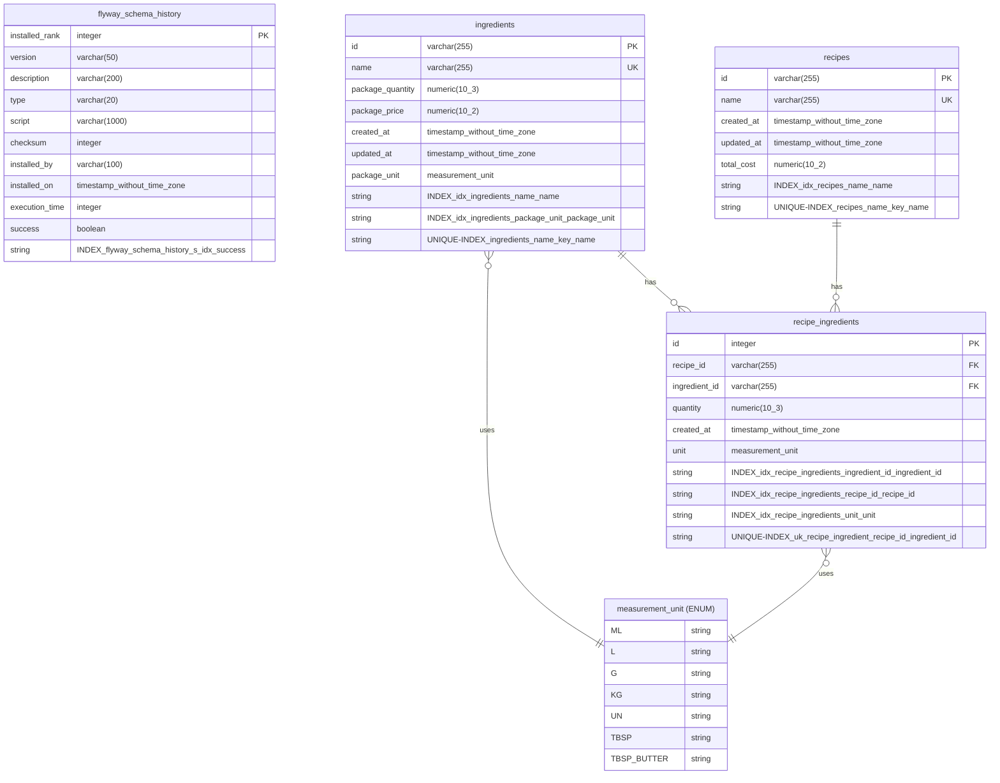

# Costify API

Backend do projeto Costify. REST API para gerenciamento de ingredientes e receitas, com cálculo de custos.

## Tech Stack

- **Java 21** (Eclipse Temurin)
- **Spring Boot 3.5.5**, Maven
- **PostgreSQL 16.9**, Flyway (migrations)
- **JUnit 5** + Testcontainers (testes)
- **Lombok**, Spring Security

## Arquitetura

Clean Architecture com três camadas:

- **`domain/`** — entidades, value objects, regras de negócio (sem dependências externas)
- **`application/`** — casos de uso, DTOs, contratos de repositório
- **`infra/`** — controllers REST, repositórios JPA, configurações Spring

## Comandos

### Via monorepo root (preferido)

```bash
make test-api                        # Rodar todos os testes
make test-api-class CLASS=FooTest    # Rodar teste específico
make deploy-api                      # Build e start da API
make logs-api                        # Ver logs
make up-db                           # Iniciar apenas o PostgreSQL
```

### Via Makefile local (dentro de api/)

```bash
make test                  # Rodar todos os testes
make test-class CLASS=Foo  # Rodar teste específico
make up                    # Iniciar postgres + app
make deploy                # Rebuild e iniciar app
make logs                  # Ver logs do app
make down                  # Parar containers
```

## Endpoints

Base URL: `http://localhost:8080/api`

| Método | Rota                        | Descrição                   |
|--------|-----------------------------|-----------------------------|
| GET    | `/ingredients`              | Listar ingredientes          |
| GET    | `/ingredients/{id}`         | Buscar ingrediente por ID   |
| POST   | `/ingredients`              | Criar ingrediente            |
| PUT    | `/ingredients/{id}`         | Atualizar ingrediente        |
| GET    | `/recipes`                  | Listar receitas              |
| GET    | `/recipes/{id}`             | Buscar receita por ID        |
| POST   | `/recipes`                  | Criar receita                |
| PUT    | `/recipes/{id}`             | Atualizar receita            |
| GET    | `/recipes/{id}/cost`        | Calcular custo da receita    |
| GET    | `/units`                    | Listar unidades disponíveis  |
| GET    | `/actuator/health`          | Health check                 |

## Unidades Disponíveis

| Nome         | Tipo   | Fator base |
|--------------|--------|------------|
| `ML`         | VOLUME | 1.0        |
| `L`          | VOLUME | 1000.0     |
| `TBSP`       | VOLUME | 15.0       |
| `G`          | WEIGHT | 1.0        |
| `KG`         | WEIGHT | 1000.0     |
| `TBSP_BUTTER`| WEIGHT | 14.0       |
| `UN`         | UNIT   | 1.0        |

## Variáveis de Ambiente

| Variável               | Padrão    |
|------------------------|-----------|
| `DB_HOST`              | postgres  |
| `DB_PORT`              | 5432      |
| `DB_NAME`              | costify   |
| `DB_USER`              | postgres  |
| `DB_PASSWORD`          | postgres  |
| `SERVER_PORT`          | 8080      |
| `CONTEXT_PATH`         | /api      |
| `DB_POOL_SIZE`         | 20        |
| `DB_POOL_MIN_IDLE`     | 5         |
| `SPRING_PROFILES_ACTIVE` | prod    |

## Migrations

Gerenciadas via Flyway em `src/main/resources/db/migration/`:

- `V1` — Criação das tabelas `ingredients` e `recipes`
- `V2` — Conversão de campos de unidade para enum
- `V3` — Remoção da coluna `unit_cost`
- `V4` — Adição da coluna `total_cost` em `recipes`

<!-- ER_DIAGRAM_START -->
## Database ER Diagram


<!-- ER_DIAGRAM_END -->
