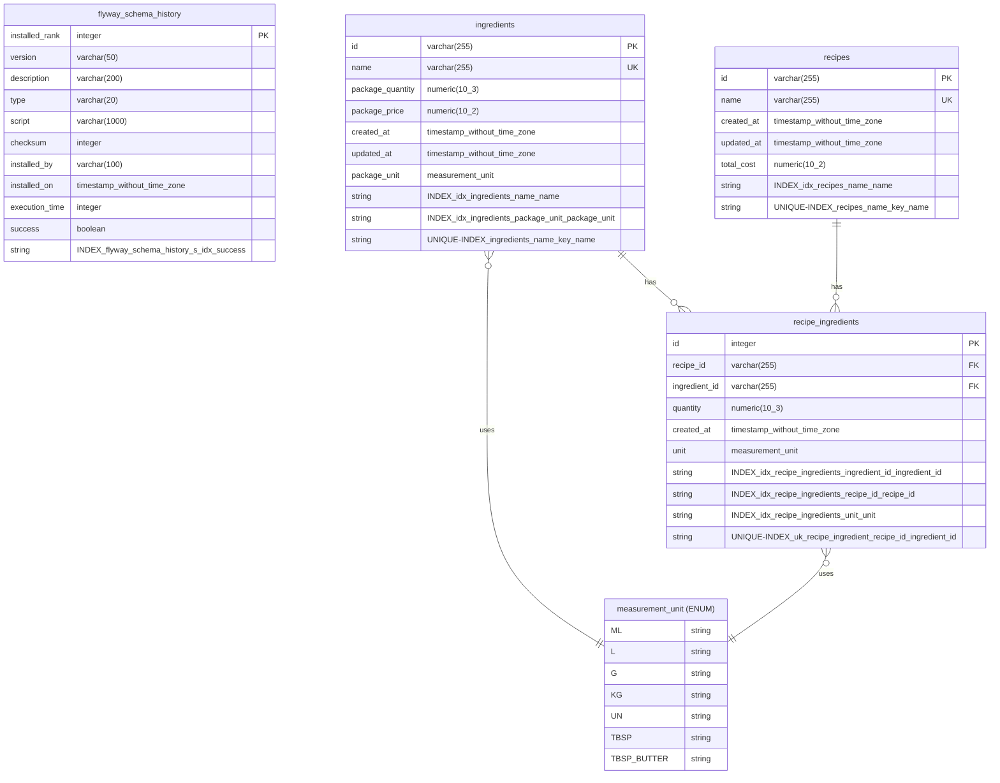

# Documentation

This directory contains automatically generated project documentation.

## Database

### Entity Relationship Diagram

The ER diagram below represents the database schema with all tables, relationships, and constraints.

<!-- ER_DIAGRAM_START -->

<!-- ER_DIAGRAM_END -->

### How It Works

The ER diagram is automatically generated by GitHub Actions on every commit to `main` that modifies database migration files.

**Workflow:**
1. Trigger on push to `main` with changes in `src/main/resources/db/migration/**`
2. PostgreSQL container is started and Flyway migrations are executed
3. ER diagram is generated from database metadata and embedded in README
4. Documentation is committed back to the repository with `[skip ci]`

**Manual Generation:**

```bash
# Ensure PostgreSQL is running
docker-compose up -d postgres

# Generate ER diagram (automatically updates README)
PGHOST=localhost PGPORT=5432 PGDATABASE=costify PGUSER=postgres PGPASSWORD=postgres \
  ./scripts/generate-er-diagram.sh
```

### Viewing the Diagram

- **GitHub**: The Mermaid diagram renders natively in GitHub's markdown viewer
- **VS Code**: Install "Markdown Preview Mermaid Support" extension
- **Other editors**: Any Mermaid-compatible markdown viewer

---

## Additional Notes

You can add custom content here and it will be preserved when the diagram is updated.

---

*This documentation is automatically updated by the CI/CD pipeline.*
